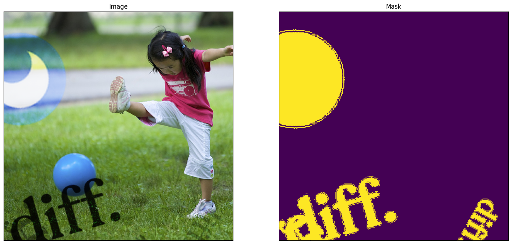
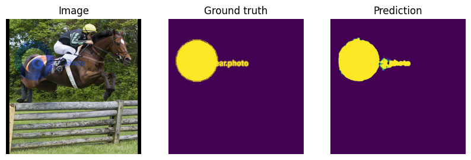

# Watermark Segmentation

<!-- Badges -->
[](https://www.python.org/)
[](LICENSE) <!-- Add a LICENSE file if you don't have one -->
[](https://arxiv.org/abs/2108.03581)
[](https://arxiv.org/abs/2012.07616)
[](https://arxiv.org/abs/2312.14383)
[](https://arxiv.org/abs/2502.02676)

<p align="center">
  <a href="https://diffusiondynamics.ai/">
    
  </a>
</p>
<p align="center">
  <a href="https://clear.photo/">
    
  </a>
</p>

This repository by [Diffusion Dynamics](https://diffusiondynamics.ai/), showcases the core technology behind the watermark segmentation capabilities of our first product, [clear.photo](https://clear.photo/). This work leverages insights from research on diffusion models for image restoration tasks.

## Introduction

Effective watermark removal hinges on accurately identifying the watermark's precise location and shape within the image. This code tackles the first crucial step: **watermark segmentation**.

We present a deep learning approach trained to generate masks highlighting watermark regions. This repository focuses on segmenting logo-based watermarks, demonstrating a robust technique adaptable to various watermark types. The methodologies employed draw inspiration from advancements in image segmentation.

This repository aims to consolidate key ideas from recent research in visible watermark removal and segmentation, including techniques presented in:
*   [arXiv:2108.03581](https://arxiv.org/abs/2108.03581) "Visible Watermark Removal via Self-calibrated Localization and Background Refinement"
*   [arXiv:2012.07616](https://arxiv.org/abs/2012.07616) "WDNet: Watermark-Decomposition Network for Visible Watermark Removal"
*   [arXiv:2312.14383](https://arxiv.org/abs/2312.14383) "Removing Interference and Recovering Content Imaginatively for Visible Watermark Removal"
*   [arXiv:2502.02676](https://arxiv.org/abs/2502.02676) "Blind Visible Watermark Removal with Morphological Dilation"

It distills these concepts into a **minimal, functional codebase** focused purely on the segmentation task. The goal is to provide a clear, understandable baseline that is easy to modify and build upon, even allowing for fine-tuning on consumer hardware like laptops with Apple M-series chips. It serves as a foundational example demonstrating the core techniques applicable to building more complex tools like [clear.photo](https://clear.photo/).

## Background: The Role of Segmentation in Watermark Removal

A typical advanced watermark removal pipeline involves:

1.  **Segmentation:** Generating a precise mask that isolates the watermark pixels from the background image content.
2.  **Inpainting/Restoration:** Using the mask to guide an algorithm (often generative, like diffusion models) to intelligently 'fill in' the region previously occupied by the watermark, seamlessly reconstructing the underlying image.

## Visuals




## Codebase Overview

This project provides the necessary tools to train a watermark segmentation model and use it for inference. Key components include:

*   **`watermark-segmentation.ipynb`:** A Jupyter notebook containing the end-to-end workflow:
    *   Model definition (utilizing the [`segmentation_models.pytorch`](https://github.com/qubvel-org/segmentation_models.pytorch) library).
    *   Dataloader setup using `dataset.py`.
    *   Training loop implementation using [`pytorch-lightning`](https://lightning.ai/docs/pytorch/stable/).
    *   Inference logic to apply the trained model to new images.
*   **`dataset.py`:** A Python script defining the `Dataset` class responsible for generating training data. It dynamically applies logo watermarks (from the `logos/` directory) onto background images with randomized properties (scale, rotation, opacity, position, blend mode) to create diverse training samples and their corresponding ground truth masks. This data augmentation strategy is key to the model's robustness.
*   **`requirements.txt`:** Lists all necessary Python dependencies.
*   **`*.pth`:** Model weights from different training epochs.
*   **`logos/`:** A directory for sample watermark logos. Populate this with logos relevant to your use case.
*   **`lightning_logs/`:** Default directory where PyTorch Lightning saves training logs and checkpoints.

## Getting Started

Follow these steps to set up and run the project:

**1. Prerequisites:**

*   Python 3.10 or later.
*   `wget` and `unzip` (or equivalent tools for downloading and extracting datasets).

```bash
python --version
# Ensure it shows 3.10.x or newer
```

**2. Clone the Repository:**

```bash
git clone https://github.com/Diffusion-Dynamics/watermark-segmentation
cd watermark-segmentation
```

**3. Install Dependencies:**

It's recommended to use a virtual environment:

```bash
python -m venv venv
source venv/bin/activate # On Windows use `virtual\Scripts\activate`
pip install -r requirements.txt
```

**4. Prepare Datasets:**

*   **Background Images:** You need a dataset of diverse background images. The original setup used Flickr8k. Download and extract it (or your chosen dataset) into a known location.
    ```bash
    # Example using Flickr8k
    wget https://github.com/jbrownlee/Datasets/releases/download/Flickr8k/Flickr8k_Dataset.zip
    unzip Flickr8k_Dataset.zip
    # Ensure the notebook points to the 'Flicker8k_Dataset' directory
    ```
*   **Watermark Logos:** Place your desired watermark logo images (PNG format with transparency is recommended) into the `logos/` directory. The `dataset.py` script will randomly use these.

**5. Run the Notebook:**

*   Launch Jupyter Lab or Jupyter Notebook:
    ```bash
    jupyter lab
    ```
*   Open `watermark-segmentation.ipynb`.
*   **Crucially, update the paths** to your background image dataset and logo directory within the notebook cells if they differ from the defaults.
*   Execute the cells to train the model and perform inference.

## Model Architecture and Training

The core segmentation model leverages standard segmentation architectures conveniently provided by the library [`segmentation-models-pytorch`](https://github.com/qubvel-org/segmentation_models.pytorch). This library offers pre-implemented models with various backbones.
To accelerate training and reduce the need for vast amounts of training data, the model utilizes a backbone pre-trained on the ImageNet dataset.

Training is managed using [`pytorch-lightning`](https://lightning.ai/docs/pytorch/stable/), which simplifies the training loop, facilitates multi-GPU training, and integrates logging.
The training process is compatible with both Apple M-series chips (via MPS) and NVIDIA GPUs (via CUDA). While NVIDIA GPUs generally offer faster training, fine-tuning on an Apple M-series chip is feasible and can typically be completed within a few hours.

The key to achieving good performance and generalization lies in the **data generation strategy** within `dataset.py`. This involves **synthetic data augmentation**: dynamically applying diverse and randomized watermarks (varying size, position, opacity, rotation, blend modes) onto clean background images during training. This forces the model learns to identify watermarks under various conditions, making it robust to unseen watermarks and backgrounds. This approach is informed by techniques discussed in related image restoration research ([arXiv:2502.02676](https://arxiv.org/abs/2502.02676)).

## Usage (Inference)

The notebook (`watermark-segmentation.ipynb`) demonstrates how to:
1. Load an input image containing a watermark.
2. Preprocess the image for the model.
3. Run the model to obtain a segmentation mask (usually a probability map).
4. Post-process the mask (e.g., thresholding) to get a binary segmentation. A common refinement step, inspired by techniques like morphological dilation discussed in works such as "Blind Visible Watermark Removal with Morphological Dilation" ([arXiv:2502.02676](https://arxiv.org/abs/2502.02676)), can be applied here to potentially expand the mask slightly, ensuring better coverage for subsequent removal steps, although this specific paper focuses on the refinement stage within the removal process itself.

The output mask precisely identifies the watermark regions, ready for use in downstream removal tasks.

## Production

Building a robust, production-ready watermark segmentation and removal system involves significant engineering challenges beyond the scope of this repository. If you require a fast, scalable, and reliable solution designed for real-world demands, consider using our platform: [clear.photo](https://clear.photo/).
